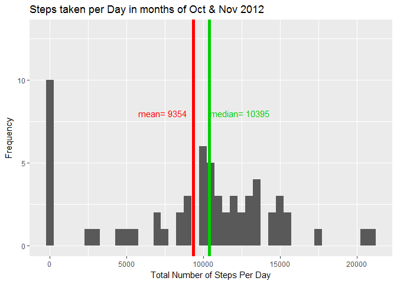
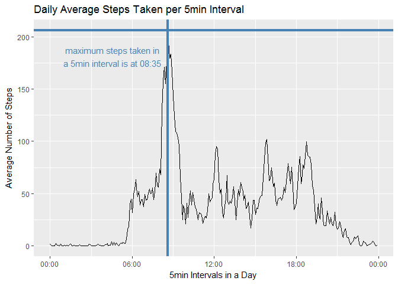
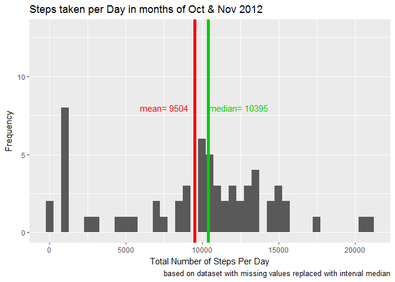
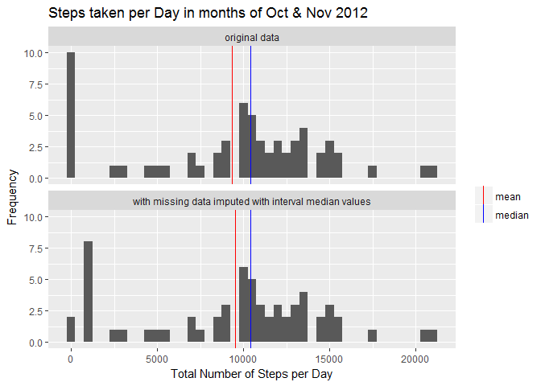
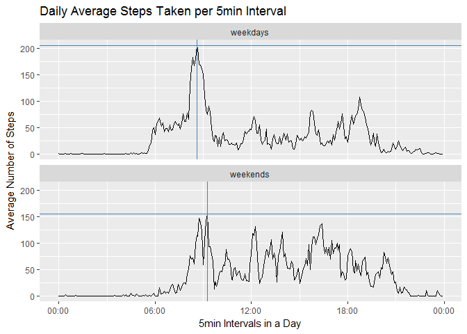

# Reproducible Research : Peer Assessment 1


## Loading and preprocessing the data
### Download and unzip given data set for course assignment: 
### https://d396qusza40orc.cloudfront.net/repdata%2Fdata%2Factivity.zip


```r
if(!file.exists("Factivity.zip")) {
    fileurl<-"https://d396qusza40orc.cloudfront.net/repdata%2Fdata%2Factivity.zip"
    download.file(fileurl, destfile= "Factivity.zip")
    unzip("Factivity.zip", junkpaths=TRUE)
}
```

### Load the activity csv data set and transform date column to Date class 


```r
actdt<-read.csv("activity.csv",header=TRUE)
actdt$date<-as.Date(actdt$date,"%Y-%m-%d")
actdt$interval<-as.ts(actdt$interval)
```

## Q1. What is mean total number of steps taken per day?
- Calculate the total number of steps taken per day
- Make a histogram of the total number of steps taken each day
- Calculate the mean and median of the total number of steps taken per day
- Report the mean and median of the total number of steps taken per day


```r
steps_per_day<-tapply(actdt$steps,actdt$date,sum,na.rm=TRUE)

library(ggplot2)
p1<-qplot(steps_per_day,binwidth=500,ylim=c(0,13),
         xlab="Total Number of Steps Per Day",
         ylab="Frequency")

savg<-mean(steps_per_day)
smed<-median(steps_per_day)

p1+labs(title="Steps taken per Day in months of Oct & Nov 2012")+
    geom_vline(xintercept=savg,colour=savg,lwd=2)+
    geom_vline(xintercept=smed,colour=smed,lwd=2)+
    annotate("text",x=round(smed+2000,0),y=8,
             label=paste("median=",as.character(smed)),colour=smed)+
    annotate("text",x=round(savg-2000,0),y=8,
             label=paste("mean=",as.character(round(savg,0))),colour=savg)
```

<!-- -->

## Q2. What is the average daily activity pattern?
- Calculate the average number of steps taken for each 5-min interval
- Make a time series plot (i.e. type = "l") of the 5-minute interval (x-axis) and the average number of steps taken, averaged across all days (y-axis)
- Identify the 5-minute interval with highest number of average steps taken
- Show the 5-minute interval, on average across all the days in the dataset, that contains the maximum number of steps


```r
avg_intvl<-tapply(actdt$steps,actdt$interval,mean,na.rm=TRUE)

ts_intvl<-paste(strrep("0",4-nchar(names(avg_intvl))),names(avg_intvl),sep="")
ts_intvl<-paste(substr(ts_intvl,1,2),":",substr(ts_intvl,3,4),sep="")
ts_intvl<-strptime(ts_intvl,format="%H:%M")

avg_per_intvl<-data.frame(interval=ts_intvl,
                          avgsteps=avg_intvl)

mavg<-max(avg_intvl)
max_intvl<-avg_per_intvl[which(avg_per_intvl$avgsteps==mavg),"interval"]

library(lubridate)
```

```
## 
## Attaching package: 'lubridate'
```

```
## The following object is masked from 'package:base':
## 
##     date
```

```r
xtxt<-max_intvl-hours(4)
ytxt<-mavg-25

ggplot(avg_per_intvl,aes(x=interval,y=avgsteps))+geom_line()+
    scale_x_datetime(date_labels="%H:%M")+
    labs(title="Daily Average Steps Taken per 5min Interval",
         x="5min Intervals in a Day",y="Average Number of Steps")+
    geom_hline(yintercept=mavg,colour="steelblue",size=1.5)+
    geom_vline(xintercept=as.integer(max_intvl),colour="steelblue",size=1.5)+
    annotate("text",x=xtxt,y=ytxt,colour="steelblue",
             label=paste("maximum steps taken in\na 5min interval is at",
                         substr(as.character(max_intvl),12,16)))
```

<!-- -->

## Imputing missing values
### Q3. What is the impact of imputing missing data on the estimates of the total daily number of steps?
#### Part 1
- Calculate and report the total number of missing values in the dataset (i.e. the total number of rows with NAs)


```r
missing<-sum(is.na(actdt$steps))
```

__________

## __*The total number of missing values in the dataset is 2304.*__

__________


### Q3. What is the impact of imputing missing data on the estimates of the total daily number of steps?
#### Part 2
- Devise a strategy for filling in all of the missing values in the dataset. The strategy does not need to be sophisticated. For example, you could use the mean/median for that day, or the mean for that 5-minute interval, etc.
- Create a new dataset that is equal to the original dataset but with the missing data filled in.


```r
med_intvl<-tapply(actdt$steps,actdt$interval,median,na.rm=TRUE)
med_per_intvl<-data.frame(interval=as.ts(names(med_intvl)),
                          medsteps=med_intvl)

tempdt<-merge(actdt,med_per_intvl,by="interval",all.x=TRUE)
NAidx<-which(is.na(tempdt$steps))
tempdt$steps[NAidx]<-tempdt$medsteps[NAidx]

library(dplyr)
```

```
## 
## Attaching package: 'dplyr'
```

```
## The following objects are masked from 'package:lubridate':
## 
##     intersect, setdiff, union
```

```
## The following objects are masked from 'package:stats':
## 
##     filter, lag
```

```
## The following objects are masked from 'package:base':
## 
##     intersect, setdiff, setequal, union
```

```r
new_actdt<-select(tempdt,-medsteps) %>% arrange(date,interval) %>%
            mutate(interval=as.ts(interval))
```

### Q3. What is the impact of imputing missing data on the estimates of the total daily number of steps?
#### Part 3
- Make a histogram of the total number of steps taken each day
- Calculate and report the mean and median total number of steps taken per day. 


```r
steps_per_day2<-tapply(new_actdt$steps,new_actdt$date,sum)

p2<-qplot(steps_per_day2,binwidth=500,ylim=c(0,13),
         xlab="Total Number of Steps Per Day",
         ylab="Frequency")

savg2<-mean(steps_per_day2)
smed2<-median(steps_per_day2)

p2+labs(title="Steps taken per Day in months of Oct & Nov 2012",
        caption=
            "based on dataset with missing values replaced with interval median")+
    geom_vline(xintercept=savg2,colour=savg,lwd=2)+
    geom_vline(xintercept=smed2,colour=smed,lwd=2)+
    annotate("text",x=round(smed2+2000,0),y=8,
             label=paste("median=",as.character(smed2)),colour=smed)+
    annotate("text",x=round(savg2-2000,0),y=8,
             label=paste("mean=",as.character(round(savg2,0))),colour=savg)
```

<!-- -->

### Q3. What is the impact of imputing missing data on the estimates of the total daily number of steps?
#### Part 4
- Do these values differ from the estimates from the first part of the assignment? 

```r
ts1<-data.frame(file="original data",
                date=names(steps_per_day),tsteps=steps_per_day)
ts2<-data.frame(file="with missing data imputed with interval median values",
                date=names(steps_per_day2),tsteps=steps_per_day2)
tsdt<-rbind(ts1,ts2)

tsavg<-tapply(tsdt$tsteps,tsdt$file,mean,na.rm=TRUE)
avg_ts<-data.frame(file=names(tsavg),tsteps=tsavg,
                   atxt=paste("mean=",as.character(round(tsavg,0))))
tsmed<-tapply(tsdt$tsteps,tsdt$file,median,na.rm=TRUE)
med_ts<-data.frame(file=names(tsmed),tsteps=tsmed,
                   atxt=paste("median=",as.character(tsmed,0)))

p3<-ggplot(tsdt,aes(tsteps))+geom_histogram(binwidth=500)+
    labs(title="Steps taken per Day in months of Oct & Nov 2012",
         x="Total Number of Steps per Day",y="Frequency")

p3+facet_wrap(~file,nrow=2)+
    geom_vline(aes(xintercept=tsteps,colour="mean"),avg_ts)+
    geom_vline(aes(xintercept=tsteps,colour="median"),med_ts)+
    scale_colour_manual("",values=c("mean"="red","median"="blue"))
```

<!-- -->

__________

## __*Showing the 2 histograms together for visual comparison*__
## __*After imputing missing values with the median value of the corresponding intervals, we can see that :-*__
## __*- the frequency of 0 steps per day has reduced*__
## __*- the median number of steps taken daily remains the same at 10395*__
## __*- but the mean number of steps taken daily has increased slightly from
 9354 to 9504*__ 

__________


## Q4. Are there differences in activity patterns between weekdays and weekends?
- Create a new factor variable in the dataset with two levels - "weekday" and "weekend" indicating whether a given date is a weekday or weekend day.
- Make a panel plot containing a time series plot (i.e. type = "l") of the 5-minute interval (x-axis) and the average number of steps taken, averaged across all weekday days or weekend days (y-axis). 


```r
new_actdt$day<-ifelse(wday(new_actdt$date)==1 | wday(new_actdt$date)==7,
                      "weekends", "weekdays")
new_actdt$day<-as.factor(new_actdt$day)

avg_per_intvl2<-aggregate(steps~day+interval,data=new_actdt,FUN=mean)

avg_per_intvl2$interval<-paste(strrep("0",
                                4-nchar(as.character(avg_per_intvl2$interval))),
                               as.character(avg_per_intvl2$interval),sep="")
avg_per_intvl2$interval<-paste(substr(avg_per_intvl2$interval,1,2),
                               ":",substr(avg_per_intvl2$interval,3,4),sep="")
avg_per_intvl2$interval<-strptime(avg_per_intvl2$interval,format="%H:%M")

mavg2<-tapply(avg_per_intvl2$steps,avg_per_intvl2$day,max)
maxdf<-data.frame(day=names(mavg2),max_steps=mavg2,
                  max_intvl2=vector("numeric",length(mavg2)))
for(i in 1:nrow(maxdf)) {
    tvl<-avg_per_intvl2[avg_per_intvl2$steps==maxdf$max_steps[i] &
                         avg_per_intvl2$day==maxdf$day[i],"interval"]
    if(exists("intvl")) intvl<-append(intvl,tvl)
    else intvl<-tvl
    }
maxdf$max_intvl2<-intvl

p4<-ggplot(avg_per_intvl2,aes(x=interval,y=steps))+geom_line()+
    scale_x_datetime(date_labels="%H:%M")+
    labs(title="Daily Average Steps Taken per 5min Interval",
         x="5min Intervals in a Day",y="Average Number of Steps")
p4+facet_wrap(~day,nrow=2)+
    geom_hline(aes(yintercept=max_steps),maxdf,colour="steelblue")+
    geom_vline(aes(xintercept=as.numeric(max_intvl2)),
               maxdf,colour="steelblue")
```

<!-- -->

__________

## __*The daily activity plots for weekdays and weekends show that the maximum average steps taken in a 5min interval is higher on weekdays and happens at an earlier time interval :-*__

|                            | **Weekdays** | **Weekends** |
|:--------------------------:|:---------:|:---------:|
| **maximum average steps taken** | **205** | **155** |
| **at time interval of** | **08:35** | **09:15** |

__________
